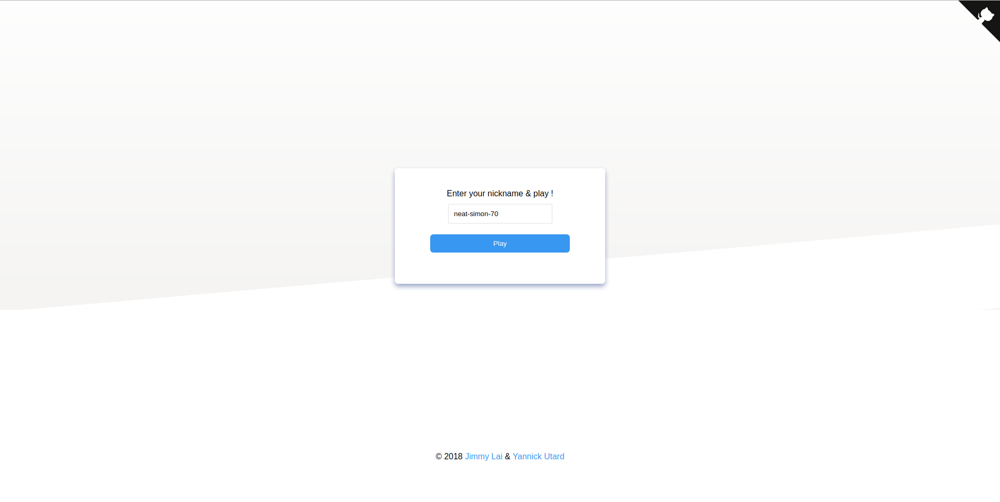
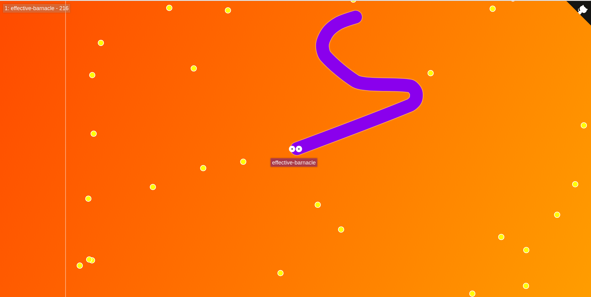

# Effective Barnacle

> A super scalable multiplayer game made with a ton of awesome technologies.

Curious about how we built it and how does it work? Read our [blog post](medium.com)!

Client:
* React, Redux, [Sagas](https://github.com/redux-saga/redux-saga)
* HTML5 Canvas
* WebSocket

Server:
* Node
* Docker
* [Traefik](https://traefik.io)

## Preview

|  | 
|:---:|:---:|
| Home page | The game

## Run it

You just need to run:

`./scripts/deploy.sh`

This script will:

* Create a `traefik_default` docker network if it doesn't exist yet
* Run `docker-compose build` to build docker images
* Run `docker-compose up -d` to start services

Services are listed below:
* 5 instances of the [Effective Barnacle server](https://github.com/feedthejim/effective-barnacle/tree/master/back) on random unused ports (`localhost:XXXX`)
* [Effective Barnacle client](https://github.com/feedthejim/effective-barnacle/tree/master/front) (`localhost:3000`)
* [Effective Barnacle orchestrator](https://github.com/feedthejim/effective-barnacle/tree/master/orchestrator) (`localhost:9000`)
* Traefik reverse proxy (`localhost:80`)
* MongoDB (`localhost:27017`)

You can also customize ports and other variables with the following environment variables:

* `EB_TRAEFIK_PORT` (`80`)
* `EB_DOMAIN_NAME` (`localhost`)
* `EB_ORCHESTRATOR_PORT` (`9000`)
* `EB_ORCHESTRATOR_SECRET` (`supersecret`)
* `EB_SERVER_DOCKER_IMAGE` (`effective-barnacle_backend`)
* `EB_MAX_CLIENTS_PER_SERVER` (`5`)
* `EB_DEFAULT_SERVERS_NB` (`5`)
* `EB_MONGO_HOST` (`mongodb`)

## Shut it down

Just run:

`./scripts/stop.sh`

> To make sure that Effective Barnacle is shutting down with this command, your server Docker image should be named **effective-barnacle_backend**.

## Contributing

Pull requests are very welcomed!

To get started in your contribution, you just need to either use the `./scripts/deploy.sh` script or install/run services in dev:

```
$ yarn install
$ yarn dev
```

## Authors

* Jimmy Lai <lai_a@epita.fr>
* Yannick Utard <yannickutard@gmail.com>
